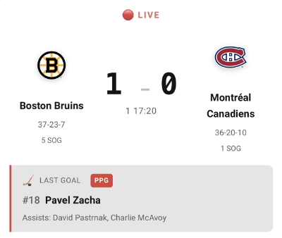
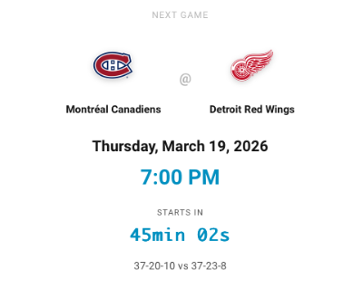
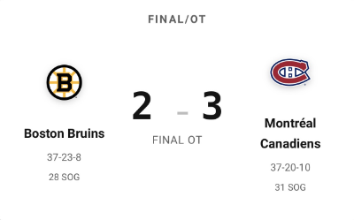

# NHL Card for Home Assistant

A custom Lovelace card to display NHL game information from the [hass-nhlapi](https://github.com/JayBlackedOut/hass-nhlapi) integration.

[](https://github.com/hacs/integration)

## Features

- 🏒 Live scoreboard with team logos
- 📊 Real-time score updates
- 🥅 Last goal information (scorer + assists)
- 🕐 Period and time remaining display
- 🏑 Shots on goal statistics
- 📺 Pregame broadcast information
- 🎨 Automatic styling for live/final/pregame states
- 📱 Responsive design

## Prerequisites

You must have the [hass-nhlapi](https://github.com/JayBlackedOut/hass-nhlapi) custom component installed and configured.

## Installation

### HACS (Recommended)

1. Open HACS in your Home Assistant instance
2. Click on "Frontend" section
3. Click the menu (⋮) in the top right corner
4. Select "Custom repositories"
5. Add this repository URL: `https://github.com/PatrioteQc/hass-nhlapi-card`
6. Select category: "Lovelace"
7. Click "Add"
8. Click "Explore & Download Repositories"
9. Search for "NHL Card" and install it
10. Restart Home Assistant (or reload the page)

### Manual Installation

1. Download the `nhl-card.js` file from the latest release
2. Copy it to your `config/www` folder (create the folder if it doesn't exist)
3. Add the resource to your Lovelace configuration:
   - Go to **Configuration** → **Dashboards** → **Resources**
   - Click **Add Resource**
   - URL: `/local/nhl-card.js`
   - Resource Type: **JavaScript Module**
   - Click **Create**
4. Refresh your browser

## Configuration

Add the card to your dashboard:

### UI Editor

1. Edit your dashboard
2. Click **Add Card**
3. Search for "NHL Card"
4. Select your NHL sensor entity
5. Configure options as needed

### YAML

```yaml
type: custom:nhl-card
entity: sensor.nhl_sensor
show_team_logos: true
show_last_goal: true
```

### Configuration Options

| Name | Type | Default | Description |
|------|------|---------|-------------|
| `entity` | string | `sensor.nhl_sensor` | The NHL sensor entity to display |
| `show_team_logos` | boolean | `true` | Show team logos |
| `show_last_goal` | boolean | `true` | Show last goal information during live games |
| `show_game_info` | boolean | `true` | Show game status (LIVE, FINAL, etc.) |

## Examples

### Basic Card

```yaml
type: custom:nhl-card
entity: sensor.nhl_sensor
```

### Without Logos

```yaml
type: custom:nhl-card
entity: sensor.canadiens
show_team_logos: false
```

### Minimal Display

```yaml
type: custom:nhl-card
entity: sensor.nhl_sensor
show_last_goal: false
show_team_logos: false
```

## Screenshots

### Live Game


### Pregame


### Final Score


## Troubleshooting

### Card not appearing
- Ensure the resource is loaded: Check **Developer Tools** → **Console** for errors
- Verify the sensor exists: Check **Developer Tools** → **States** for your NHL sensor

### No data displayed
- Verify hass-nhlapi integration is working
- Check sensor attributes in Developer Tools

### Logos not showing
- Some logos may not load if the NHL API doesn't provide them
- The card will fallback to team names only

## Support

For bugs and feature requests related to this card, please [open an issue](https://github.com/PatrioteQc/hass-nhlapi-card/issues).

For issues with the NHL API data itself, please use the [hass-nhlapi repository](https://github.com/JayBlackedOut/hass-nhlapi).

## License

MIT License - See [LICENSE](LICENSE) for details.
